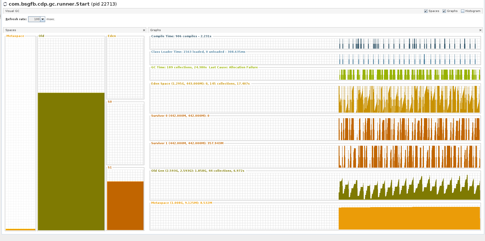

# Multithreading: Classic Model and Concurrency

1. Создать тестовую java-программу, которая в бесконечном цикле
2. создаёт большое количество объектов разного размера, на какое-то время держит на них референсы
3. объекты должны ссылаться друг на друга (когда создаётся очередная пачка объектов, нужно рандомным образом между ними создать связи)
4. должно быть столько объектов чтобы программе было тяжело работать из-за постоянного заполнения хипа и очистки его GC
5. Затюнить памяти, сконфигурировать разные типы GC (CMS, G1, Parallel, Serial, etc.), затюнить их параметры.
6. С помощью JVM параметров настроить запись лога GC, по логу определить на сколько GC приостанавливал JVM и сколько данных очищалось
Визуализировать лог с помощью программы gcviewer
Посмотреть на работу GC с помощью JVisualVM и плагина VisualGC
7. Добиться OutOfMemoryException и StackOverflowError, пояснить как это произошло, как добились.
8. Сравнить GC, выбрать какой из них в каких случаях работает лучше
9. Закомитать программу, инструкцию с параметрами запуска JVM для каждого GC, логи GC, скриншоты из GCViewer, VisualGC или аналогов.

## Getting Started

### Prerequisites

* [Gradle](https://gradle.org/) - Dependency Management, [how to install](https://gradle.org/install/)

## Tasks
#### 1 - 4
```
./gradlew gc:runApp -Dgc.objectsNumber="5000"
```
gc.objectsNumber - the number of objects to create



#### 5 - 6, 8, 9
[GC report](docs/GC.md)


#### 7
Run application with StackOverflowError
```
./gradlew gc:stackOverflowRunApp -Dgc.jvm="-Xss1m"
```

Run application with OutOfMemoryException
```
./gradlew gc:runApp -Dgc.objectsNumber="15000" -Dgc.jvm="-Xmx1g -Xms500m -Xmn250m"
```

StackOverflowError happened because function recursively call itself.
Each function call puts new frame on top of stack. After a lot of calls, stack memory is end.
OutOfMemoryException happened because there is a lot of objects in heap.


## Built With

* [Gradle](https://gradle.org/) - Dependency Management

## Authors

* **Siarhei Blashuk** - *Developer* - [BSGfB](https://github.com/BSGfB)
