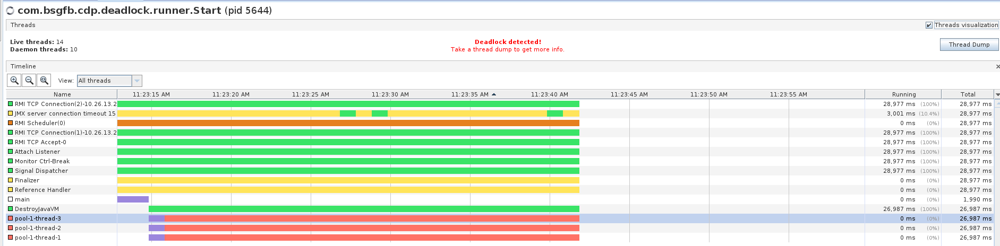

# Multithreading: TASK 2

1. Emulate none trivial deadlock. At least three threads should take participation In deadlock. Catch & analyze this deadlock using visualvm and/or jconsole.
2. Fix the deadlock from p. 1 using none blocking synchronization.

## Getting Started

### Prerequisites

* [Gradle](https://gradle.org/) - Dependency Management, [how to install](https://gradle.org/install/)

### Run application with deadlock
```
./gradlew multithreading:deadlock:runDeadlockApp
```
### Run application with deadlock
```
./gradlew multithreading:deadlock:runNonLockApp
```
## Running the tests

### Unit tests

```
./gradlew multithreading:deadlock:test
```

## Overview results
Visual vm graphics:

[threaddump](../res/threaddump.txt)

## Built With

* [Gradle](https://gradle.org/) - Dependency Management

## Authors

* **Siarhei Blashuk** - *Developer* - [BSGfB](https://github.com/BSGfB)
